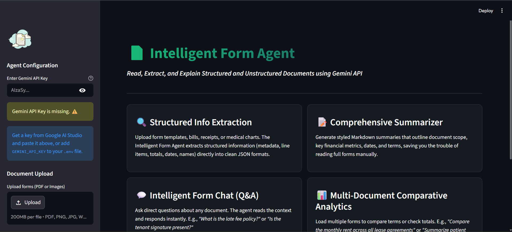
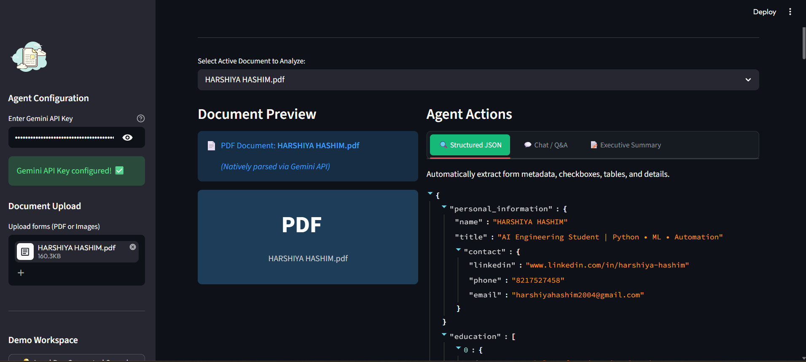
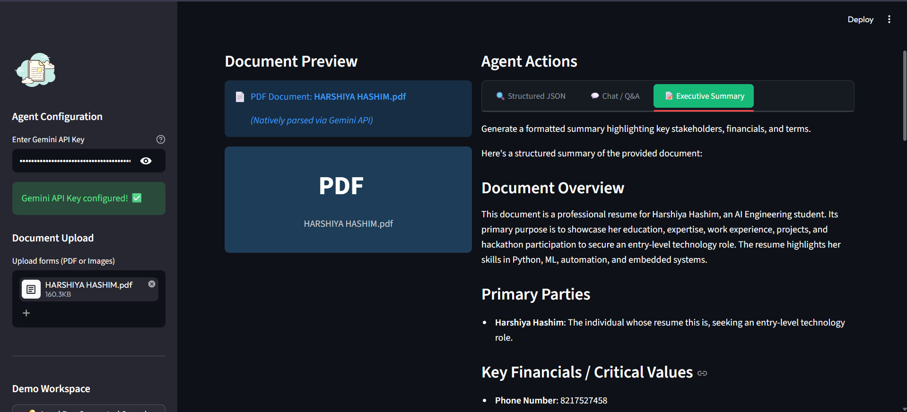
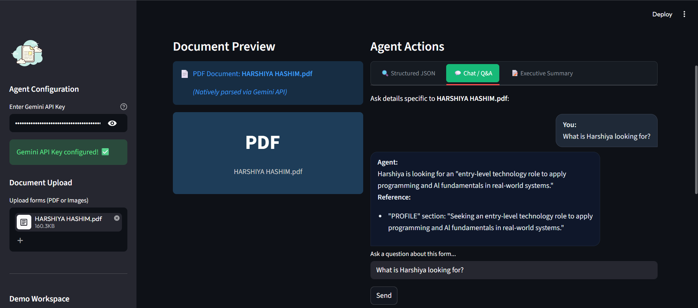
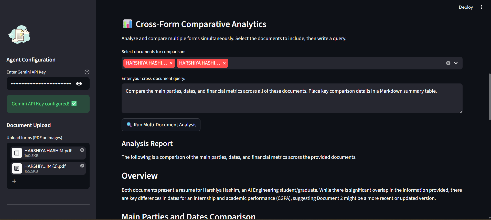

# Intelligent Form Agent

An intelligent document understanding and parsing agent that processes, extracts, summarizes, and answers questions about structured and unstructured forms (PDFs and images) using Google's Gemini API. 
## Screenshots

### Home Screen


### Structured JSON Extraction


### Executive Summary


### Q&A Interface


### Cross Form Comparative Analysis


## Features

- **Structured JSON Extraction**: Automatically extract metadata, tabular line items, checkboxes, names, dates, and signature statuses into clean, organized JSON format.
- **Intelligent Q&A**: Interactively chat with single documents to answer complex semantic questions (e.g. *"What is the utility policy?"*).
- **Executive Summaries**: Generate detailed summaries in Markdown format highlighting primary parties, dates, financials, and terms.
- **Cross-Form Analytics**: Compare multiple documents simultaneously (e.g. *"Compare rent terms and party names across all lease agreements"*).
- **Interactive UI**: A gorgeous Streamlit dashboard for visual preview, interactive chatting, and schema-structured data downloads.
- **CLI Utility**: Command-line interface for integration into automated scripts and pipelines.

---

## Getting Started

### Prerequisites
- **Python 3.8+** installed.
- A **Google Gemini API Key** (from [Google AI Studio](https://aistudio.google.com/)).

### Installation
1. Clone this repository or open the folder:
   ```bash
   cd intelligent-form-agent
   ```
2. Install the Python dependencies:
   ```bash
   pip install -r requirements.txt
   ```
3. Configure your API key by copying `.env.example` to `.env` and adding your key:
   ```bash
   copy .env.example .env
   ```
   Edit `.env` and replace `your_gemini_api_key_here` with your actual key:
   ```env
   GEMINI_API_KEY=AIzaSy...
   ```

---

## Step-by-Step Execution Guide

### Step 1: Generate Pre-Built Sample Forms
The project includes a utility script that programmatically draws three realistic, high-fidelity sample form images (an invoice, a patient medical intake form, and a lease agreement) using the Pillow library:
```bash
python data/generate_samples.py
```
This generates the following files in the `/data` directory:
- `data/sample_invoice.png` (INV-2026-0891, Apex Cloud Services LLC, Total $705.25)
- `data/sample_medical.png` (Jane Doe, Medical checklist, Allergies: Penicillin & Peanuts)
- `data/sample_rental.png` (Alice Cooper & Robert Vance, 742 Evergreen Terrace, Rent $1,800/mo)

### Step 2: Running CLI Command Line Examples

#### 1. Extract Structured Data (JSON Output)
Extract form details from the sample invoice:
```bash
python src/agent.py extract data/sample_invoice.png
```
*Expected Output:* A clean JSON block containing metadata, lines items, subtotals, grand totals, and notes.

#### 2. Single-Form Question Answering (Q&A)
Ask about allergies in the medical intake form:
```bash
python src/agent.py ask data/sample_medical.png "Does the patient have allergies, and what are they?"
```
*Expected Output:* "Yes, the patient Jane Doe is allergic to Penicillin and Peanuts, which cause mild hives and swelling."

#### 3. Single-Form Summarization (Markdown Output)
Generate a summary of the rental agreement:
```bash
python src/agent.py summarize data/sample_rental.png
```
*Expected Output:* A structured Markdown document containing Document Overview, Primary Parties, Key Financials, Important Terms, and Execution Status.

#### 4. Cross-Form Comparison (Multiple Documents)
Compare details across the lease agreement and invoice:
```bash
python src/agent.py analyze-multi data/sample_invoice.png data/sample_rental.png --query "What are the total financial liabilities mentioned in these files?"
```
*Expected Output:* A comparative analysis of the invoice grand total ($705.25 due June 15, 2026) and the lease agreement rent ($1,800.00/month) and security deposit ($2,000.00).

---

### Step 3: Running the Interactive Web UI

Launch the Streamlit web dashboard:
```bash
streamlit run src/app.py
```
Once started, open the local URL in your browser (usually `http://localhost:8501`).

1. **API Key Setup**: Ensure your API key is configured (loaded from `.env` or input directly in the sidebar).
2. **Load Samples**: Click the **💡 Load Pre-Generated Sample Forms** button in the sidebar to populate the demo forms.
3. **Analyze**:
   - Choose a form from the dropdown to preview it.
   - Explore the tabs for **Structured JSON**, **Chat / Q&A**, and **Executive Summary**.
   - Download extracted JSON data and markdown summaries directly.
4. **Cross-Form Analytics**: Scroll down to select multiple documents, input a comparison query, and view generated reports in real-time.

---

## Codebase Structure
- `/src` - Core agent logic, CLI client, and Streamlit app.
- `/data` - Utility script and generated sample forms.
- `/tests` - Pytest/unittest suite.
- `/docs` - Architecture diagram, data flows, and design notes.
