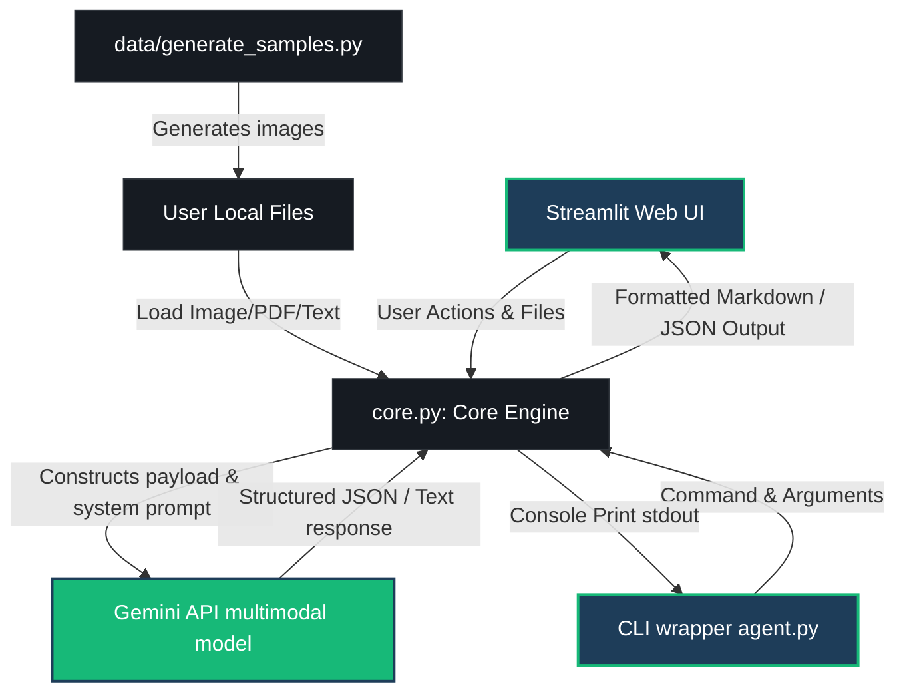

# Architecture and Design Notes

This document describes the architectural layout, pipeline processing steps, and details of the **Intelligent Form Agent**.

## Pipeline Overview

The agent handles unstructured and structured documents via a multimodal parsing pipeline powered by the Gemini API. Because Gemini natively processes multiple modalities (images, PDFs, text) in its context window, we avoid the need for heavy local dependencies such as OCR engines (Tesseract) or PDF layout extraction libraries.

### System Architecture Diagram



---

## Core Components and Modules

### 1. Document Loading and Mime-type Normalization
Located in `src/core.py` under [load_file_for_gemini](file:///C:/Users/Harshiya%20Hashim/.gemini/antigravity/scratch/intelligent-form-agent/src/core.py#L22):
- **Images (`.png`, `.jpg`, `.jpeg`, `.webp`)**: Loaded via Pillow (`PIL.Image`) to verify format integrity, then passed directly to the SDK.
- **PDFs (`.pdf`)**: Read in binary mode and packaged into the Gemini-compliant payload dictionary `{"mime_type": "application/pdf", "data": bytes}`.
- **Text Documents (`.txt`, `.csv`, `.json`, `.html`)**: Read using UTF-8 encoding and passed directly as text contexts.

### 2. Structured Information Extraction
For structured key-value parsing, the agent leverages Gemini's native structured outputs.
- We request structured key-value extraction using `response_mime_type="application/json"` in the `generation_config`.
- This ensures the LLM performs schema-compliant JSON generation without embedding markdown code block wraps (such as ` ```json `), guaranteeing clean dictionary parsing in the calling client.

### 3. Cross-Document Comparative Analytics
For multi-document QA, the agent loads multiple documents and passes them in sequence to the Gemini context window. 
- Prompt engineering instructs the model to compare parameters across different documents, highlight discrepancies, perform basic mathematical operations (such as summing total expenditures across multiple invoices), and output clean markdown comparison tables.

---

## Creative Extensions

1. **Programmatic Form Generator (`generate_samples.py`)**: Uses PIL to draw high-fidelity simulated documents (medical records, invoices, leases), complete with line borders, check boxes, simulated hand signatures, and multi-font typography. This makes testing the system end-to-end self-contained and reproducible.
2. **Streamlit UI Interface (`app.py`)**:
   - **Interactive Chat Q&A**: Employs session-cached chat bubbles allowing users to converse with any active document in real time.
   - **Interactive JSON Tree Viewer**: Renders structured extraction outputs as collapsible nodes with instant download buttons.
   - **Compare Panel**: Let users multi-select uploaded forms and run analytical queries over them dynamically.
